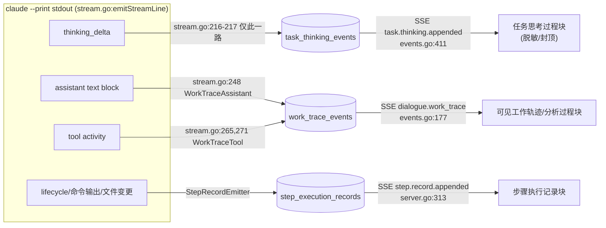

# 数据流转脊柱（代码核验版）

> 本文件是 [`implementation-principles.md`](./implementation-principles.md) 第 3 节（从对话到应用的主流程）与第 6 节（流式事件分层）的**代码级核验**，不重复设计叙述，只把每条数据流转断言钉到 `file:line` 证据并标注 CONFIRMED。
> 设计意图与"为什么这么设计"请看原理文档；本文件回答"代码里到底是不是这样、在哪一行"。
> 仓库根：`factory-server/`（Go 后端）、`sf-portal-mvp/`（React 前端）。

## 贯穿全流程的不变量

**先持久化，后发布。** 每一次模型调用都是无状态的新子进程（`claude --print`，不复用 session、不 `--resume`），所有"记忆"都显式落在 SQLite 与 artifact 文件里；SSE 只把这些已落库的事实实时/可回放地推给前端。事件层的硬约束是：没有落库就没有事件。

- **记忆载体（SQLite）**：`dialogue_sessions` / `dialogue_messages` / `dialogue_turns` / `clarification_sessions` / `clarification_messages` / `jobs` / `job_steps` / `job_step_edges` / `work_trace_events` / `task_thinking_events` / `step_execution_records` / `application_versions` / `deployments` / `applications`。全部 DDL 在 `factory-server/internal/store/schema.sql`。
- **记忆载体（artifact 文件）**：每次 step attempt 一个目录，含 `input.json` / `prompt.md` / `output.json` / `output.md` / `stdout.log` / `stderr.log`（`internal/runner/artifacts.go:37,40`）。

---

> **全链路时序图**见 [`implementation-principles.md`](./implementation-principles.md) §3（从对话到应用的主流程），此处不重复。下面直接按阶段给出每条断言的 `file:line` 核验。

## 阶段 0 ｜ 发起对话

| 断言 | 证据 | 状态 |
|---|---|---|
| `POST /api/dialogues` → `createDialogue` | 路由 `internal/server/server.go:496`；handler `internal/server/dialogue_handlers.go:772` | ✅ |
| 落 `dialogue_sessions`（status=active） | INSERT `internal/store/dialogues.go:18`；schema `internal/store/schema.sql:186` | ✅ |
| 落 `dialogue_messages`（role=user） | INSERT `internal/store/dialogues.go:78`；schema `schema.sql:210`（列：`id,dialogue_id,role,kind,content,metadata_json,created_at`） | ✅ |
| 全局 SSE 推 `dialogue.*` 创建事件 | `internal/server/events.go` 经 `s.hub.Publish(Event{Type: ev.Type, Data: ev})`，事件类型以 `dialogue.` 前缀 | ✅ |

## 阶段 1 ｜ 意图路由（会话路由）

| 断言 | 证据 | 状态 |
|---|---|---|
| 写一条 `dialogue_turns`（status=pending） | `internal/server/dialogue_handlers.go:1032-1039`（`Status: model.TurnStatusPending`） | ✅ |
| turn_worker 认领最老 pending turn | 认领查询 `internal/store/dialogue_turns.go:89`：`SELECT id FROM dialogue_turns WHERE dialogue_id=? AND status='pending' ORDER BY created_at ASC LIMIT 1`；worker 在 `internal/server/turn_worker.go` | ✅ |
| spawn `claude --print`，工具限 Read/Grep/Glob | `internal/dialogue/runner.go:167-172`：`--print` + `--permission-mode plan` + `--allowedTools Read,Grep,Glob` + `--disallowedTools Bash,Edit,Write` | ✅ |
| 流式解析（thinking_delta / text_delta / result） | `internal/runner/stream.go`；thinking_delta → `dialogue.*.thinking`；result → 结构化路由决策 | ✅ |
| 路由决策字段 | `intent / confidence / existingApplicationSlugs / internalBlueprintSlug / userFacingReason / needsRouteConfirmation`（`stream.go` result 解码） | ✅ |
| 路由结果写回 `dialogue_turns.intent` 与 `dialogue_sessions` 状态 | `internal/store/dialogues.go:124`：`UPDATE dialogue_sessions SET intent=?, status=?, draft_json=? ...` | ✅ |
| 工作轨迹落 `work_trace_events`（dialogue_id + 单调 sequence） | INSERT `internal/store/work_traces.go:143`；sequence 由 `MAX(sequence)+1` 分配；schema `schema.sql:275` | ✅ |
| 路线确认 `POST /api/dialogues/:id/route` → `selectDialogueRoute` | 路由 `server.go:504`；handler `dialogue_handlers.go:1278` | ✅ |

## 阶段 2 ｜ 需求澄清（应用生成路线）

| 断言 | 证据 | 状态 |
|---|---|---|
| 澄清子会话表 `clarification_sessions` + `clarification_messages` | schema `schema.sql:132` / `:151`；store `internal/store/clarifications.go` | ✅ |
| 每轮 `clarification/runner.go` 起一次 `claude --print` | `internal/clarification/runner.go` | ✅ |
| 用户回答 `POST /api/dialogues/:id/clarification/answers` → `answerDialogueClarification` | 路由 `server.go:506`；handler `dialogue_handlers.go:1603` | ✅ |
| 高影响事项/研判边界/数据来源边界累积进"确认需求摘要"草稿 | 存于 `clarification_sessions.requirement_json` / `open_high_impact_json`（schema `:132`），确认后落到 `jobs.confirmed_requirement_json`（schema `:37`） | ✅ |
| `collaboration.DefaultPlan` 生成 12/13 智能体计划 | `internal/collaboration/plan.go:90`。**12 个基础智能体**：collaboration-orchestrator / requirement-analyst / domain-analyst / designer / data-integration / solution-designer / code-generator / code-reviewer / tester / product-acceptance / image-builder / deployer；当 `needsSecurityReview` 为真时在 code-reviewer 后插入 `security-reviewer`（`plan.go:139-142`）→ **共 13 个** | ✅ |
| Mode = `topological_serial` | `plan.go:143`：`Mode: "topological_serial"` | ✅ |
| 修复策略：每任务 ≤2 次、同因 ≤1 次 | `plan.go:152`：`RepairPolicy{MaxAutomaticRepairs: 2, MaxAutomaticRepairsPerBlockingReason: 1}` | ✅ |
| 前端组装 `collaboration_plan_preview` + 执行图视图 | `sf-portal-mvp/src/hooks/dialogueTimeline.js:427-430`（`collaboration_plan_preview` 项，`graph: buildCollaborationExecutionGraphView(...)`） | ✅ |
| 图视图 `confirmed=false` → 走"逐个 reveal / 待确认"状态 | `sf-portal-mvp/src/hooks/collaborationExecutionGraphState.js:146` 返回 `confirmed`；`:166` `if (!confirmed) return 'pending_confirmation'`。**核验修正**：字段名为 `confirmed`（非 `graph.confirmed`），预览阶段 steps 无 stepId → `confirmed=false` → 全部卡片 `pending_confirmation`；逐个 reveal 的渲染逻辑在 `components/CollaborationExecutionGraph.jsx` | ✅（措辞修正） |

## 阶段 3 ｜ 确认并生成 → 任务落库

| 断言 | 证据 | 状态 |
|---|---|---|
| 确认 `POST /api/dialogues/:id/clarification/confirm` → `confirmDialogueClarification` | 路由 `server.go:510`；handler `dialogue_handlers.go:1899` | ✅ |
| 落 `jobs`：一行，`collaboration_plan_json` 整包写入，`dialogue_id` 外键关联 | handler `dialogue_handlers.go:89-94`（`CollaborationPlanJSON: planJSON` + `DialogueID: id`）；INSERT `internal/store/jobs.go:14-20`；schema `schema.sql:37`（列含 `collaboration_plan_json`、`dialogue_id`） | ✅ |
| 落 `job_steps`：每智能体一行，带 status/attempt/`snapshot_json` | schema `schema.sql:66`；`snapshot_json` 列存在；快照解析 `internal/executor/claude_runner.go:108,209` | ✅ |
| `snapshot_json` = 本次任务智能体配置快照，编辑不写回全局 skill | `claude_runner.go:224` 注释："这是本次生成任务的协作智能体配置快照，只影响当前任务，不写回全局 .claude/skills" | ✅ |
| 落 `job_step_edges`：依赖边（DAG） | schema `schema.sql:85`（`from_step_id`/`to_step_id`）；edges 由 `plan.go:123-137` 定义并随 `SeedClarificationJobWithEdges` 落库（`dialogue_handlers.go:98`） | ✅ |
| `executor.New()` 接管，`topological_serial` 拓扑串行 | Mode 来自计划 `plan.go:143`；executor 在 `internal/executor/executor.go:48-50` | ✅ |
| 同应用按 `app_slug` 串行化（store 抢占） | `internal/store/jobs.go:373-419`：claim 排除 `app_slug` 与任一 running job 相同的 queued job；注释 `:390` "SERIALIZATION KEY IS app_slug (NOT application_id)" | ✅ |
| 跨应用并发上限 `FACTORY_MAX_CONCURRENT_JOBS`（1..16） | `internal/config/config.go:88-102`：默认 3，clamp `[1,16]` | ✅ |

## 阶段 4 ｜ 步骤执行（每个协作智能体节点）— 三流分流深挖

### 4.1 单次 step attempt 的搬运

`executor/claude_runner.go` 从 SQLite 读出本次 attempt 的全部输入，组装成 artifact，spawn 全新 `claude --print`：

| 输入 | 读取点 | 证据 |
|---|---|---|
| 确认需求摘要 | `job.ConfirmedRequirementJSON` | `claude_runner.go:92` |
| 项目本地 skills + 蓝本 | `selectedSkillPaths(c.workspace(), profile)` | `claude_runner.go:106` |
| 修复上下文 | `step.UserPrompt`（作为 `repairContext`） | `claude_runner.go:118` |
| 智能体配置快照 | `parseCollaborationStepSnapshot(step.SnapshotJSON)` | `claude_runner.go:108,209` |
| prompt | `c.prompt(job, step, ws, skillPaths, ...)` | `claude_runner.go:132` |

组装与 spawn：

- 写 `input.json` + `prompt.md`：`internal/runner/claude.go:126,129`（`os.WriteFile(ws.InputPath()/PromptPath())`）；路径定义 `internal/runner/artifacts.go:37,40`。
- spawn `claude --print`：`internal/runner/claude.go:78`。**生成阶段** `--allowedTools Read,Grep,Glob,Edit,Write` + `--disallowedTools Bash`（`:80-81`）；**只读阶段** `--allowedTools Read,Grep,Glob` + `--disallowedTools Bash,Edit,Write`（`:89-92`）。
- **无 `--resume`、不复用 session**：`claude.go:33` 注释 "drives one `claude --print` invocation per step attempt"；argv 中无 `--resume`/`--continue`/`--session-id`。

### 4.2 output.json 机器执行契约校验

- `output.json` 是 step stdout 落盘的机器契约，结构由 `codeGenerationOutput` 等定义（`claude_runner.go:30,41`；gate 输出 `:418,196`）。
- 校验/解码在 executor 侧进行（runner 本身不校验：`claude.go:108` "It does NOT validate output.json"）。解码 + needsUserInput 一致性检查：`claude_runner.go:196-206`；非法 JSON → `output_invalid_json` 错误（`claude_runner.go:451`）；`stream.go:440` 剥离包裹 JSON 的代码围栏后再 `Unmarshal`。**校验通过才推进。**

### 4.3 三流分流（核心）

> 设计意图（为什么故意拆成不同事件流）见 [`implementation-principles.md`](./implementation-principles.md) §6 流式事件分层；本节只钉代码里的路由决策点与各表的安全约束。

这是数据流最容易混的地方。同一条 `claude --print` stdout 流被 `internal/runner/stream.go` 的 `emitStreamLine` 路由到**三个互斥的 sink**，每个 sink 对应一张独立表 + 一条独立 SSE：

**路由决策点（`stream.go:211 emitStreamLine`）**：

- `thinking_delta` → **仅** `TaskThinkingEmitter`，绝不进 records 或 traces。`stream.go:216-217`："thinking_delta is routed to TaskThinkingEmitter only (never to records or traces)"。
- assistant text block → `WorkTraceAssistant` trace（`stream.go:248`）。
- tool activity → `WorkTraceTool` trace（`stream.go:265,271`）。
- 生命周期/命令输出/文件变更 → `StepRecordEmitter`（records）。

**三张表的边界（schema 注释即设计意图）**：

| 表 | schema | 内容 | 安全约束 |
|---|---|---|---|
| `task_thinking_events` | `schema.sql:301` | 原始 provider thinking（`content` + `redacted` 标志）。列含 `dialogue_id, task_id, step_id, attempt, agent_key, dialogue_sequence, step_sequence` | "excluded from visible work trace... surfaced only in task_execution_block **after credential redaction/capping**"；`dialogue_sequence` 每 dialogue 单调，`step_sequence` 每 (task,step,attempt) 单调 |
| `work_trace_events` | `schema.sql:275` | 可见活动审计（`type` 白名单 + `payload_json` 生产者摘要）。列含 `dialogue_id, sequence, task_id, application_id, version_id, step_id, attempt, agent_key, type, payload_json` | "NEVER holds raw hidden reasoning... store gate rejects provider thinking/thinking_delta, raw bodies, headers, credentials, and uncapped command output"；`sequence` 每 dialogue `MAX+1` 单调 |
| `step_execution_records` | `schema.sql:166` | 不可变步骤审计（生命周期/活动摘要/命令 stdout-stderr/错误）。列含 `job_id, step_id, attempt, sequence, kind, content, truncated` | `sequence` 每 (step,attempt) 由 executor 分配，`UNIQUE(step_id, attempt, sequence)` |

> **为什么必须是三张独立表、三条独立 SSE，而不是一张统一事件表？** 因为三者的**可见性边界与脱敏策略不同**：
> 1. `task_thinking_events` 是**隐藏推理**，只在对话 UI 的"任务思考过程"块里、经凭证脱敏/封顶后展示，**不进**可见工作轨迹、步骤审计、导出面。
> 2. `work_trace_events` 是**可见活动**，但只存白名单 `type` + 生产者摘要，**严禁**承载原始 thinking/raw body/凭证——它是用户能看到的"分析过程"。
> 3. `step_execution_records` 是**不可变执行审计**，含命令原始 stdout/stderr，面向步骤抽屉/导出，不面向对话流。
> 一张统一表无法同时表达"同一份 thinking 既要在任务思考块可见、又绝不能进可见轨迹/审计导出"这种正交的可见性矩阵；分表 + 分流让每张表的写入门禁（store gate）各自收紧，从结构上杜绝越界。

### 4.4 三条独立 SSE 端点

| 流 | 端点 | handler | 事件类型 | 发布点 |
|---|---|---|---|---|
| 全局事件 | `GET /api/events` | — | `step.record.appended` / `app.updated` / `dialogue.*` 等 | `server.go:313`（step.record）、`events.go` |
| 可见工作轨迹 | `GET /api/dialogues/:id/work-trace/stream` | `dialogueTraceStream`（`server.go:522`） | `dialogue.work_trace` | `events.go:177` |
| 任务思考 | `GET /api/dialogues/:id/task-thinking/stream` | `dialogueTaskThinkingStream`（`server.go:527`） | `task.thinking.appended` | `events.go:411` |

### 4.5 门禁修复回路

- 阻断式失败（code-review / security-review / product-acceptance）→ 带 failure context 回退到 code_generator 重跑。
- 可修复性判定：`executor.go:924 repairableFailureKind`；`executor.go:990-991` 明确**基础设施错误**（`ErrorPortUnavailable`、`ErrorPodmanRunFailed`）**不进回路**——重生成不会释放端口或修复运行时故障。
- 计数上限：默认 `MaxAutomaticRepairs=2`、`MaxAutomaticRepairsPerBlockingReason=1`（`executor.go:1004-1005`，与 `plan.go:152` 一致）；同因到达上限即停（`executor.go:1048 byReason[reasonKey] >= maxAutomaticRepairsPerBlockingReason`）。
- 同因去重 key 形如 `code_review:blocking_review:same:...`（`executor.go:1145`）；`health_check_failed` 不可修复（`executor.go:1126`）。

### 4.6 前端订阅与折叠

- 三条流分别订阅：`sf-portal-mvp/src/hooks/useDialogueSessions.js:629 subscribeDialogueTrace`、`:662 subscribeDialogueTaskThinking`、`:711 subscribeFactoryEvents`（全局，含 `step.record.appended`，见 `useJobs.js:333`）。
- 折叠成"任务执行块"：`hooks/dialogueTimeline.js:123-153`（每 in-flight step 一个 `task_execution_block` 描述符）。

## 阶段 5 ｜ Factory 步骤（构建部署）

| 断言 | 证据 | 状态 |
|---|---|---|
| `factory_steps.go` 跑 `npm ci`/`npm run build` | `internal/executor/factory_steps.go:206-210,218-230`（经 `runCmd` → `exec.Command`，非 Claude Bash 工具） | ✅ |
| 候选版本目录 `versions/<version-id>/` | `factory_steps.go:257`：`candidateDir := filepath.Join(srcDir, "versions", version.ID)`；创建 `:424-432 prepareCandidateSource` | ✅ |
| podman/docker 构建镜像 | `factory_steps.go:340`：`rt.BuildImage(ctx, buildApp, version.ID)` | ✅ |
| 启容器 | `factory_steps.go:497`：`rt.RunContainer(...)` | ✅ |
| HTTP 健康检查 | `factory_steps.go:516`：`health(ctx, healthURL, deploy.HealthCheckTimeout())` | ✅ |
| `application_versions` 候选→effective/superseded | schema `schema.sql:249`（status `queued|building|failed|effective|superseded`）；提升 `internal/store/application_versions.go:145-187` | ✅ |
| 健康检查通过才提升；失败旧版本继续服务 | `factory_steps.go:509-551`：失败标记 version failed 并保留 prior effective（fresh app 无 prior 则置 error）；成功调 `PromoteApplicationVersion` | ✅ |
| `deployments` 落库 | schema `schema.sql:105`；insert `internal/store/deployments.go:19-27` | ✅ |
| `applications.runtime_url` 更新 | `internal/store/deployments.go:108-115`（`UPDATE applications SET status=?, runtime_url=? ...`）；列 `runtime_url`（`schema.sql:16`） | ✅ |
| SSE `app.updated` / `deployment.updated` | `internal/server/events.go:136 publishAppUpdated`、`publishDeploymentUpdated` | ✅ |

---

## 证据附录：核验状态汇总

全部断言 **CONFIRMED**（阶段 2"graph.confirmed"一处措辞已修正为 `confirmed` 字段）。核验所用关键文件：

- 路由注册：`factory-server/internal/server/server.go:495-527`
- dialogue handlers：`factory-server/internal/server/dialogue_handlers.go`
- turn worker：`factory-server/internal/server/turn_worker.go`
- 流解析与三流路由：`factory-server/internal/runner/stream.go`
- claude 子进程：`factory-server/internal/runner/claude.go`、`internal/runner/artifacts.go`
- 协作计划：`factory-server/internal/collaboration/plan.go`
- 步骤执行/修复回路：`factory-server/internal/executor/executor.go`、`claude_runner.go`、`factory_steps.go`
- 全部表 DDL：`factory-server/internal/store/schema.sql`
- 配置/并发：`factory-server/internal/config/config.go`
- SSE 事件：`factory-server/internal/server/events.go`
- 前端订阅/折叠：`sf-portal-mvp/src/hooks/useDialogueSessions.js`、`useJobs.js`、`dialogueTimeline.js`、`collaborationExecutionGraphState.js`
