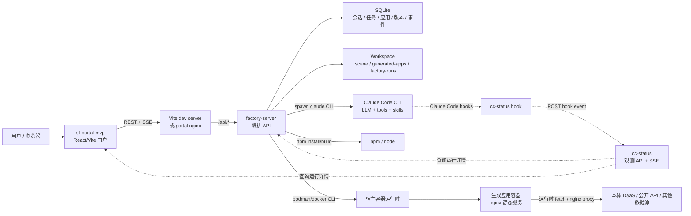
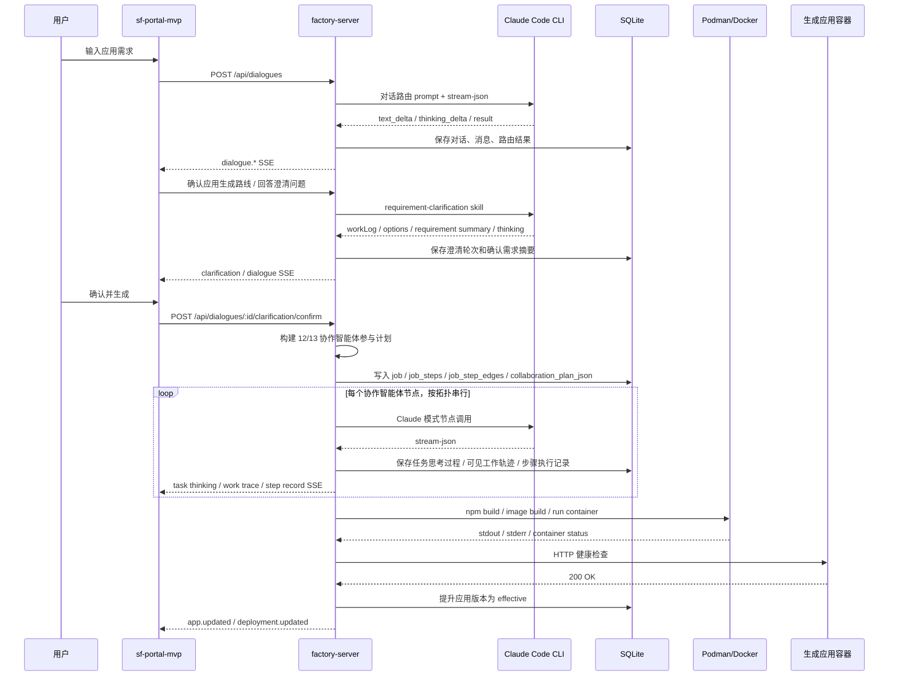
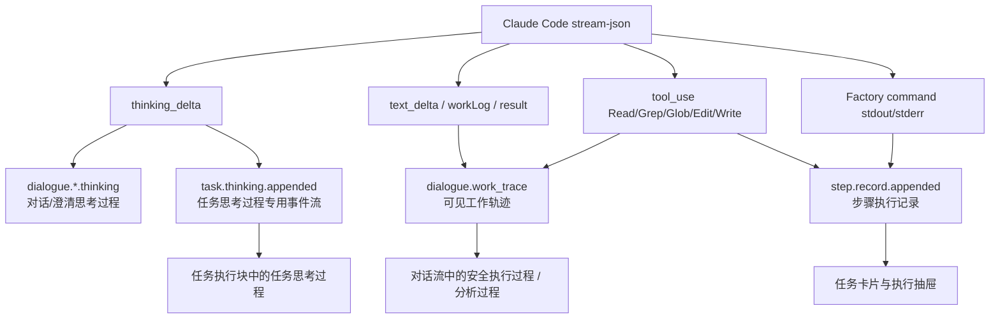

# 软件工厂系统实现原理说明

本文面向技术负责人、交付团队和后续维护工程师，说明 xian630 智能软件工厂从用户对话到生成应用部署的完整实现原理。它不是接口清单或源码逐行导读，而是把服务边界、数据流、Claude Code 调用机制、多协作智能体执行模型、流式事件分层、部署结构和生成应用生命周期串起来。

## 1. 技术方案总览

xian630 是一个本地优先的智能软件工厂闭环。用户在门户里用自然语言描述应用需求，系统先通过对话和需求澄清把需求收敛成结构化确认摘要，再生成协作智能体参与计划，最后由 factory-server 调用 Claude Code、npm 和容器运行时完成代码生成、构建、镜像化、部署和健康验证。

核心技术栈：

- 前端门户：`sf-portal-mvp`，React + Vite，通过 REST 和 SSE 与后端交互。
- 编排服务：`factory-server`，Go + SQLite，负责对话、需求澄清、协作计划、任务执行、状态持久化、构建部署和事件推送。
- LLM 执行：本地 Claude Code CLI，由 `factory-server` 以子进程方式调用。
- 观测服务：`cc-status`，通过 Claude Code hooks 观察 session、subagent、skill 生命周期。
- 构建与部署：npm 构建静态 Vite 应用，Podman/Docker 构建镜像并启动容器。
- 反向代理：本地开发时前端可直连 `factory-server`；容器化交付时由 portal nginx 对外服务并反代 `/api/*`。

系统的关键边界是：**前端不直接调用 Claude Code，cc-status 不编排生成任务，factory-server 是唯一的任务编排者和 Claude Code 调用者。**

## 2. 总体服务关系



服务职责：

- `sf-portal-mvp`：用户入口，展示对话、应用商店、任务区、协作智能体卡片、执行记录和生成应用入口。
- `factory-server`：系统核心，负责创建对话、调用 Claude Code、生成协作计划、推进任务状态、落库、推送事件、构建和部署应用。
- `cc-status`：观测旁路，记录 Claude Code session、subagent、skill 和 background task 生命周期；不可用时不影响生成主流程。
- `nginx`：容器化交付入口，服务门户静态文件并反代 factory API；生成应用容器内的 nginx 还负责静态资源服务和数据源代理。
- `podman/docker`：运行生成应用容器。容器化交付时 factory 容器通过挂载宿主 runtime socket 操作宿主运行时。

实现位置：

- `factory-server/internal/server/server.go`：服务初始化、路由注册、执行器接线、Claude runner 接线。
- `factory-server/internal/server/events.go`：全局 SSE、对话 work trace SSE、事件发布。
- `factory-server/internal/ccstatus/client.go`：cc-status 只读观测客户端。
- `cc-status/internal/install/install.go`：Claude Code hook 安装。
- `deploy/compose.yaml`、`deploy/nginx/portal.conf`：容器化交付结构。

## 3. 从对话到应用的主流程

软件工厂的主流程不是“用户输入后立即生成代码”，而是分成对话收敛、协作计划确认和任务执行三个阶段。

1. 用户在门户输入需求。
2. `factory-server` 创建或继续一个对话会话。
3. 对话路由模型判断是已有应用复用、应用生成，还是其他会话意图。
4. 应用生成路线进入需求澄清子流程。
5. 需求澄清通过多轮结构化问题、推荐收敛和最终确认生成“确认需求摘要”。
6. `factory-server` 根据确认需求摘要构建协作智能体参与计划。
7. 用户确认需求摘要和协作计划后，系统创建生成任务。
8. 生成任务按协作智能体 DAG 的拓扑顺序串行推进。
9. Claude Code 阶段产出结构化契约、设计、代码和审查结论。
10. Factory 阶段执行 npm 验证、镜像构建、容器启动和健康检查。
11. 健康检查通过后，新版本被提升为生效版本，应用进入门户应用目录。



实现位置：

- `factory-server/internal/dialogue/runner.go`：对话路由、业务草稿等 Claude Code 调用。
- `factory-server/internal/clarification/runner.go`：需求澄清 Claude Code 调用。
- `factory-server/internal/server/dialogue_handlers.go`：对话 API、路线确认、澄清确认、任务创建。
- `factory-server/internal/executor/executor.go`：任务推进、步骤状态、记录发布。
- `factory-server/internal/executor/claude_runner.go`：Claude 模式步骤提示词、契约校验和能力包注入。

## 4. 多协作智能体参与计划

当前主模型是协作智能体参与计划，不再是用户可见的固定六阶段流水线。固定六阶段仍作为旧任务或没有协作计划任务的兼容回退。

默认协作智能体为 12 个：

| 泳道 | 智能体 | 职责 |
|---|---|---|
| analysis | 协作编排 | 生成默认协作计划，记录用户调整，解释选择依据 |
| analysis | 需求分析 | 校验确认需求摘要完整性和高影响事项 |
| analysis | 领域分析 | 注入领域知识、场景蓝本、数据来源边界和客户判断口径 |
| analysis | 设计 | 产出视图、布局、组件、交互状态和响应式约束 |
| analysis | 数据接入 | 定义真实数据接入计划、运行时连接器和不可用数据行为 |
| generation | 方案设计 | 汇总需求、领域、设计和数据契约 |
| generation | 代码生成 | 生成应用源码、manifest、构建和运行配置 |
| generation | 代码审查 | 阻断式质量门禁，检查正确性、部署性、数据诚实和用户行为 |
| delivery | 测试验证 | 运行或分析构建与测试结果 |
| delivery | 产品验收 | 对照需求、设计、数据契约和主流程验收 |
| delivery | 镜像构建 | 构建应用容器镜像 |
| delivery | 部署 | 启动容器并完成健康验证 |

当需求涉及公网数据、认证、上传、外部接口、敏感数据、权限或暴露部署面时，系统条件加入第 13 个协作智能体：

| 泳道 | 智能体 | 职责 |
|---|---|---|
| generation | 安全审查 | 检查安全、权限、凭证、外部接口和暴露部署面风险 |

协作计划不是展示用图，而是可执行依赖图：

- `collaboration_plan_json` 保存计划、泳道、参与智能体、修复策略和调整记录。
- `job_steps` 承载每个协作智能体节点的状态、尝试次数、执行记录归属和产物归属。
- `job_step_edges` 表达协作智能体之间的依赖。
- `snapshot_json` 保存本次任务的协作智能体配置快照，编辑只影响当前任务，不写回全局 `.claude/skills/*`。
- `Mode=topological_serial` 表示当前按 DAG 拓扑串行执行，不做同一任务内并行调度。

质量门禁包括代码审查、安全审查和产品验收。阻断式门禁失败时，系统按修复策略有界回退到代码生成，默认每个任务最多 2 次自动修复，同一阻断原因最多 1 次；端口占用、容器运行基础设施错误等不可通过代码生成修复的问题不进入自动修复回路。

实现位置：

- `factory-server/internal/collaboration/plan.go`：`DefaultPlan`、12/13 协作智能体、三条泳道、依赖边和修复策略。
- `factory-server/internal/store/collaboration_plans.go`：协作计划、步骤边和快照持久化。
- `factory-server/internal/executor/steps.go`：步骤类型、Claude 模式和 Factory 模式映射。
- `factory-server/internal/executor/executor.go`：拓扑串行推进、门禁失败和修复回路。
- `sf-portal-mvp/src/hooks/collaborationPlanState.js`：协作计划前端视图模型。
- `sf-portal-mvp/src/components/JobCenter.jsx`：协作泳道和任务卡片渲染。

## 5. Claude Code 与 LLM 调用机制

Claude Code 的调用者是 `factory-server`。前端不持有 Claude Code 会话，也不直接调用 LLM。

调用方式：

- 对话路由、需求澄清和任务步骤都通过本地 `claude` CLI 子进程执行。
- CLI 使用 `--print` 以无交互方式运行。
- 流式调用使用 `--output-format stream-json --include-partial-messages --verbose`。
- `factory-server` 为不同阶段设置不同工具权限：
  - 路由和澄清：只允许 `Read/Grep/Glob`，禁止 `Bash/Edit/Write`。
  - 代码生成：允许 `Read/Grep/Glob/Edit/Write`，禁止 `Bash`。
  - npm、镜像构建和部署由 Factory 自己执行，不让 Claude Code 直接运行 Bash。
- 生成能力通过项目本地 `.claude/skills/*` 注入，Claude Code 按确认需求摘要中的 `generationProfile` 读取相关 skill。
- 场景蓝本只作为结构、交互、数据模型参考，生成应用代码必须写在 `generated-apps/<slug>/` 下，不能复制 `scene/` 源码。

上下文管理：

- 系统不依赖 Claude Code CLI 自身的交互会话记忆，也不通过 `--resume`、`--continue` 或 session id 复用上一次 Claude 会话。
- 每一次对话路由、需求澄清、协作智能体步骤和重试，都是一次新的 `claude --print` 子进程调用。
- `factory-server` 在调用前把本轮所需上下文显式写入 artifact：`input.json` 保存结构化输入，`prompt.md` 保存执行指令，`stdout.log` / `stderr.log` 保存 Claude Code 输出审计。
- 对话类调用从 SQLite 读取持久化会话、最近消息、已绑定应用等状态，组装成有界输入后交给 Claude Code。
- 任务类调用从 SQLite 读取 `job`、`job_step`、确认需求摘要、协作智能体快照、修复上下文、skill 路径和场景蓝本路径，组装为本次步骤的 `input.json`。
- 后续步骤不假设 Claude Code 记得前一步；它们只依赖 Factory 持久化的结构化产物、生成文件、执行记录和重新组装的 prompt。

并发边界：

- 同一生成任务内部按协作计划的拓扑顺序串行执行，不并行调用多个协作智能体节点。
- `Executor` 可以同时推进多个任务，默认 `FACTORY_MAX_CONCURRENT_JOBS=3`，配置值被限制在 `1..16`，避免一次启动过多 Claude 子进程。
- 同一应用按 `app_slug` 串行化。原因是同一应用的多个任务会写入同一个 `generated-apps/<slug>/` 目录，并复用同一镜像 tag；并行写入会造成破坏性竞争。
- 不同应用的任务可以并发执行。每个 Claude 调用都有独立 artifact 目录、独立 step 归属和独立 SSE 事件归属，避免输出流在业务层串线。
- 并发 Claude 子进程仍共享本机 Claude Code 安装、认证、全局 settings、hooks、模型额度和宿主资源；这些是容量与限流风险，不是上下文串线风险。
- `cc-status` hooks 只做 best-effort 观测。即使多个 Claude session 同时触发 hook，任务编排和状态归属仍以 `factory-server` 的 job/step/attempt 为准。

Claude Code 输出被拆成几类：

- `text_delta`：面向用户的分析、摘要或结构化输出。
- `thinking_delta`：模型思考过程，根据上下文进入对话思考流或任务思考流。
- `tool_use`：安全工具活动，如 Read、Grep、Glob、Edit、Write，用于生成安全执行过程和文件变更摘要。
- `result`：最终结构化 JSON 契约，例如需求摘要、方案设计或代码生成输出。

实现位置：

- `factory-server/internal/runner/claude.go`：Claude CLI 参数、子进程调用、stream-json 捕获。
- `factory-server/internal/runner/stream.go`：stream-json 解析、工具活动和安全输出提取。
- `factory-server/internal/executor/claude_runner.go`：各 Claude 模式步骤的 prompt、output.json 契约和 skill 注入。
- `factory-server/internal/executor/executor.go`：任务 worker pool、同任务步骤串行推进、步骤归属 emitter。
- `factory-server/internal/store/jobs.go`：按 `app_slug` 抢占和串行化同应用任务。
- `factory-server/internal/config/config.go`：`FACTORY_MAX_CONCURRENT_JOBS` 并发上限解析与限制。
- `factory-server/internal/dialogue/runner.go`：对话路由流式思考与分析输出。
- `factory-server/internal/clarification/runner.go`：需求澄清流式思考与结构化问题输出。
- `factory-server/internal/server/turn_worker.go`：普通对话轮次的有界历史输入组装。

## 6. 流式事件分层

系统故意把“思考过程”“分析过程”“安全执行过程”“步骤执行记录”拆成不同事件流，避免把模型原始思考、用户可见工作轨迹、命令输出和审计记录混在一起。



事件分层说明：

- **对话/澄清思考过程**：由 `dialogue.route.thinking`、`dialogue.draft.thinking`、`dialogue.clarification.thinking` 等事件承载，展示在中央对话流的“思考过程”块。
- **任务思考过程**：由专用任务归属思考流承载。事件按 `dialogue_id`、`task_id`、`step_id`、`attempt`、`agent_key` 归属到具体任务执行块；内容做凭证脱敏和大小限制，不做摘要改写。
- **可见工作轨迹**：由 `work_trace_events` 持久化并通过 `dialogue.work_trace` 推送，包含分析、工具活动摘要、数据源决策、验证、任务/版本/部署状态等可复盘事实。
- **步骤执行记录**：由 `step_execution_records` 持久化并通过 `step.record.appended` 推送，服务于任务卡片和执行抽屉，包含系统状态、工具活动、文件变更、命令 stdout/stderr、错误等。

任务思考过程不写入 `work_trace_events`，也不写入 `step_execution_records`。这样既能在对话流里展示任务归属的思考过程，又能保持工作轨迹和执行记录的安全审计边界。

实现位置：

- `factory-server/internal/store/task_thinking.go`：任务思考事件的追加、回放、脱敏和删除。
- `factory-server/internal/store/work_traces.go`：可见工作轨迹的安全 allowlist、序列和脱敏。
- `factory-server/internal/store/execution_records.go`：步骤执行记录持久化。
- `factory-server/internal/server/events.go`：SSE 发布、回放和持久化后发布。
- `sf-portal-mvp/src/api/events.js`：全局事件、对话 work trace、任务思考事件订阅。
- `sf-portal-mvp/src/hooks/dialogueTimeline.js`：对话流和任务执行块组装。

## 7. 三个核心服务的功能与架构

### 7.1 cc-status

`cc-status` 是 Claude Code 观测服务，不是任务编排服务。

工作方式：

1. `cc-status install` 向 Claude Code settings 写入 hooks。
2. Claude Code 在 session、subagent、skill 等生命周期事件发生时触发 hook。
3. hook 子进程读取 stdin 中的 Claude Code hook payload。
4. hook 进程 POST 到 `cc-status serve`。
5. `cc-status` 写入 SQLite，并通过 REST 和 SSE 暴露运行状态。

它观察的事件包括 `SessionStart/End`、`UserPromptSubmit`、`SubagentStart/Stop`、`PreToolUse(PostToolUse)` 中的 Skill/Agent、`Stop` 等。hook 是 best-effort：如果 `cc-status` 不可用，hook 退出成功并记录 stderr，不阻塞 Claude Code。

实现位置：

- `cc-status/internal/install/install.go`：hook 安装和卸载。
- `cc-status/internal/hook/parse.go`、`cc-status/internal/hook/report.go`：hook payload 解析和上报。
- `cc-status/internal/ingest/ingest.go`：事件入库和发布。
- `cc-status/internal/server/server.go`：REST 和 SSE API。

### 7.2 factory-server

`factory-server` 是系统核心编排服务。

主要职责：

- 管理对话会话、会话阶段和历史会话。
- 调用 Claude Code 完成意图路由、需求澄清、方案设计、代码生成和审查类步骤。
- 构建协作智能体参与计划，并把计划映射到 `job_steps` 和 `job_step_edges`。
- 管理生成任务状态、步骤状态、尝试次数、取消、重试和修复。
- 持久化应用、版本、部署、任务、协作计划、工作轨迹、任务思考和执行记录。
- 执行 npm 构建、镜像构建、容器启动、健康检查和版本提升。
- 扫描 `scene/` 和 `generated-apps/` 中的 `.factory/app.json`，统一注册预置应用和生成应用。
- 通过 REST 和 SSE 向门户提供状态、增量事件和历史回放。

实现位置：

- `factory-server/internal/server/server.go`：依赖装配和路由。
- `factory-server/internal/store/schema.sql`：SQLite 主要数据结构。
- `factory-server/internal/executor/executor.go`：任务状态机和执行调度。
- `factory-server/internal/executor/factory_steps.go`：测试验证、镜像构建、部署。
- `factory-server/internal/scanner/manifest.go`：应用 manifest 解析和校验。

### 7.3 sf-portal-mvp

`sf-portal-mvp` 是用户操作入口。

主要职责：

- 展示会话导航、中央对话工作台、应用商店、任务区和执行抽屉。
- 通过 REST 创建对话、回答澄清、确认需求、打开应用、控制任务。
- 通过全局 SSE 接收 `app.*`、`job.*`、`step.*`、`dialogue.*`、`deployment.*` 等事件。
- 对选中对话额外订阅可回放的 work trace 和任务思考事件。
- 将协作计划渲染为三条泳道和多个协作智能体任务卡片。
- 将步骤执行记录、artifact、任务思考过程和安全执行过程组合成可读的任务执行视图。

实现位置：

- `sf-portal-mvp/src/api/client.js`：REST API 客户端。
- `sf-portal-mvp/src/api/events.js`：SSE 订阅。
- `sf-portal-mvp/src/hooks/useDialogueSessions.js`：对话工作台状态和事件折叠。
- `sf-portal-mvp/src/hooks/dialogueTimeline.js`：对话时间线和任务执行块。
- `sf-portal-mvp/src/components/ConversationWorkbench.jsx`：中央对话工作台。
- `sf-portal-mvp/src/components/JobCenter.jsx`：任务区和协作泳道。

## 8. 部署结构

### 8.1 本地开发模式

本地开发时通常启动三个进程：

- `cc-status`：`127.0.0.1:8765`
- `factory-server`：`127.0.0.1:8787`
- `sf-portal-mvp`：`localhost:3001`

门户通过 `VITE_FACTORY_API_BASE_URL` 指向 `factory-server`。`factory-server` 启用 CORS，因此 Vite dev server 可以跨域调用。Claude Code、npm、podman/docker 都在本机执行。

本地开发适合调试：

- 对话和澄清流。
- Claude Code 真实调用或 `FACTORY_FAKE_CLAUDE=1` 的生成任务假 runner。
- SSE 事件和前端渲染。
- 本机容器部署和健康检查。

### 8.2 容器化交付模式

容器化交付时，外部只访问 portal nginx：

```text
用户浏览器 → portal nginx :80
  ├─ /           → sf-portal-mvp 静态文件
  ├─ /api/*      → factory-server:8787
  └─ /healthz    → factory-server:8787
```

`factory-server` 容器不直接暴露到公网。portal 构建时 `VITE_FACTORY_API_BASE_URL=""`，前端请求走同源 `/api`，由 nginx 反代到 factory 容器。nginx 对 `/api` 关闭 `proxy_buffering`，以支持 SSE 长连接。

factory 容器内置：

- `factory-server` Go 二进制。
- Claude Code CLI。
- Node/npm。
- Podman CLI 和 Docker CLI。
- `.claude/skills` 和 `scene` 参考资产。

factory 容器通过挂载宿主运行时 socket 操作宿主 Podman/Docker。生成应用容器实际运行在宿主容器运行时上，端口由 factory 分配。

`cc-status` 在当前交付结构里作为观测旁路说明，不强行并入 `deploy/compose.yaml` 主链路。若后续需要容器化 cc-status，应单独补充部署说明。

实现位置：

- `deploy/Dockerfile.factory`：factory 镜像，包含 Claude Code CLI、Node、podman/docker CLI 和项目技能资产。
- `deploy/Dockerfile.portal`：portal 构建和 nginx 静态服务。
- `deploy/compose.yaml`：factory/portal 服务、数据卷、runtime socket 挂载。
- `deploy/nginx/portal.conf`：`/api` 反代和 SSE 配置。
- `docs/software-factory-local-runbook.md`、`deploy/README.md`：现有运行说明。

## 9. 数据源、本体接口与 LLM 的边界

数据源调用必须区分生成期和运行期。

生成期：

- Claude Code 读取需求摘要、协作计划、skill、场景蓝本和数据源约束。
- Claude Code 生成应用代码、数据接入适配器、nginx 代理配置和降级态。
- 生成期的 Claude Code 工具不能成为应用运行时的数据源。

运行期：

- 生成应用在浏览器或应用容器内通过运行时可访问的接口取数。
- 本体/DaaS 通常通过生成应用自己的 nginx 代理访问，例如浏览器请求 `/api/ontology/...`，nginx 再转发到本体服务。
- nginx 注入鉴权头、空间 ID、scopeType 等，避免浏览器 CORS 问题和 token 暴露。
- 数据源不可用时，应用必须展示降级态，说明失败原因、尝试的数据源、结构预览和手动重试入口，不能编造 mock 数据冒充真实结果。

`factory-server` 不定位为通用本体查询网关。它负责：

- 在澄清和生成时确认数据来源边界。
- 把 data-skill 和本体契约传给 Claude Code。
- 校验生成结果是否满足真实数据和降级态要求。
- 构建和部署包含运行时数据访问逻辑的应用。

实现位置：

- `.claude/skills/carrier-affiliation-data-skill/SKILL.md`：本体/DaaS 数据能力约束。
- `.claude/skills/carrier-affiliation-data-skill/references/ontology-api.md`：本体 API、nginx proxy、字段契约。
- `factory-server/internal/executor/claude_runner.go`：诚实数据契约和 data-skill 注入。
- `factory-server/internal/executor/factory_steps.go`：生成应用 nginx 配置修正和本体代理凭证注入。
- `factory-server/internal/server/app_operations.go`：应用启动/重建时 nginx 配置修正。
- `generated-apps/*/nginx.conf`、`generated-apps/*/src/data*`：生成应用运行时数据接入实现。

## 10. 生成应用的实现原理和部署生命周期

生成应用是一个可独立构建、镜像化和部署的应用项目，通常位于：

```text
generated-apps/<slug>/
  .factory/app.json
  package.json
  src/
  public/
  Dockerfile
  nginx.conf
  dist/
  versions/<version-id>/
```

关键契约：

- `.factory/app.json` 是 Factory manifest，声明 slug、name、source、entry、path、build、runtime、docker 等信息。
- `source=generated` 表示由软件工厂生成。
- `entry=static-vite` 表示当前主要支持静态 Vite 前端应用。
- `build.command` 通常是 `npm run build`。
- `build.outputDir` 通常是 `dist`。
- `docker.runtimePort` 通常是 nginx 容器内端口 80。

构建部署生命周期：

1. Claude Code 在 `generated-apps/<slug>/` 下写入源码、manifest、Dockerfile 和 nginx 配置。
2. Factory 扫描并注册应用。
3. 测试验证阶段创建候选版本目录 `versions/<version-id>`，避免直接修改当前生效源码。
4. Factory 在候选版本目录执行 `npm ci` 或 `npm install`，再执行 `npm run build`。
5. 镜像构建阶段使用候选版本目录构建 `localhost/software-factory/<slug>:<version-id>`。
6. 部署阶段分配宿主端口，启动容器并做 HTTP 健康检查。
7. 健康检查通过后，候选版本提升为 `effective`，旧生效版本变为 `superseded`。
8. 健康检查失败时，候选版本标记失败；如果已有旧生效版本，旧版本继续服务。

这个版本提升策略保证了生成应用不会因为一次失败部署破坏已有可用版本。

实现位置：

- `factory-server/internal/scanner/manifest.go`：manifest 解析和校验。
- `factory-server/internal/executor/factory_steps.go`：候选版本、npm 构建、镜像构建、部署和健康检查。
- `factory-server/internal/store/application_versions.go`：应用版本、生效版本提升和旧版本替换。
- `factory-server/internal/deploy/podman.go`、`factory-server/internal/deploy/docker_runtime.go`：容器运行时适配。
- `generated-apps/*/.factory/app.json`：生成应用 manifest 示例。

## 11. 已知边界和非目标

当前系统需要明确这些边界：

- 主要面向本地/单机/单用户智能软件工厂闭环，不是完整多租户 SaaS。
- 协作智能体按拓扑串行执行，不是同一生成任务内部并行 DAG。
- `cc-status` 是观测旁路，不是生成任务的编排依赖。
- `factory-server` 不是通用本体数据查询网关。
- 生成应用当前以静态 Vite + nginx 容器为主，不是任意后端应用生成平台。
- 固定六阶段仍作为旧任务或没有协作计划任务的兼容回退。
- 全局 `.claude/skills/*` 默认只读；协作智能体任务卡片编辑的是本次任务快照。

## 12. 后续可拆分文档

本文是实现原理总览。后续如果文档继续增长，建议按文档作用拆分到：

```text
docs/software-factory/
  overview/
    implementation-principles.md
  design/
  deployment/
  generated-apps/
  operations/
  decisions/
```

可优先拆分：

- `deployment/deployment-architecture.md`：容器化部署、网络、runtime socket、安全组。
- `generated-apps/generated-app-principles.md`：生成应用目录、manifest、构建、部署和版本机制。
- `operations/observability-runbook.md`：cc-status、SSE、日志、任务执行记录和排障。
