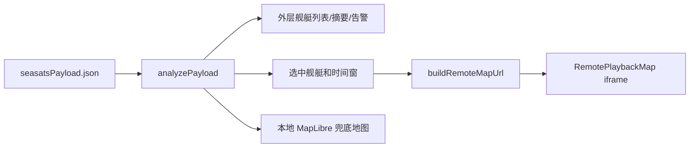

# Seasats 舰艇轨迹回放中心改版设计

## 背景

现有 `scene/seasats-test-craft-monitor` 已具备舰艇清单、MapLibre 地图、告警、轨迹分析图表和本地附件数据解析能力。当前页面信息密度偏高，图表较多，地图只是众多模块之一，不利于非专业用户快速理解“哪艘舰艇值得关注、在哪里、轨迹发生了什么变化”。

用户确认新版采用“轨迹回放中心”方向，并要求嵌入远程地图：

```text
http://218.61.33.200:18000/?mmsi=338414915&start_time=1735689600&end_time=1783036799
```

该远程页面是 Vue/Vite 单页地图应用。HTTP 检查显示响应头未包含 `X-Frame-Options` 或明显阻止嵌入的 CSP `frame-ancestors` 限制，因此主方案使用 `iframe` 嵌入。若运行时被浏览器或服务端策略阻止，提供原始地图外链和本地 MapLibre 地图兜底。

## 目标

1. 将“目标”相关文案统一改为“舰艇”。
2. 页面以远程地图回放为主视觉和主操作区，弱化冗余图表。
3. 支持“只看关注舰艇”模式，隐藏其他舰艇干扰。
4. 支持按选中舰艇构造远程地图 URL，传入 `mmsi`、`start_time`、`end_time`。
5. 让非专业用户一眼能看懂当前态势：关注舰艇、风险、位置、速度快慢、方向、异常点。
6. 保留现有本地分析数据，用于外层清单、摘要、告警和兜底地图。

## 非目标

1. 不反向改造远程 `218.61.33.200:18000` 地图应用。
2. 不在本地复制远程 Vue 地图源码。
3. 不新增后端服务。
4. 不保留所有现有分析图表；复杂图表按用户要求删除或折叠。
5. 不改变附件数据生成脚本和原始数据文件。

## 用户体验设计

### 首屏结构

首屏采用“地图最大化 + 浮层控制”的回放中心布局：

- 顶部：产品标题、舰艇总数、告警数、当前数据时间窗、只看关注舰艇开关。
- 中央：远程地图 iframe，占据页面主要面积。
- 左侧抽屉/侧栏：舰艇列表、搜索、风险筛选、关注舰艇选择。
- 右侧浮层：当前舰艇关键研判、速度、航向、AIS 中断、最近告警。
- 底部：回放时间窗、当前舰艇速度/方向说明、异常点图例。

默认模式显示全局态势，并高亮当前舰艇；开启“只看关注舰艇”后，页面只围绕当前舰艇展示，其他舰艇清单和外层干扰信息收起。

### 远程地图嵌入

新增 `RemotePlaybackMap` 组件负责 iframe 嵌入。URL 由当前选中舰艇和时间窗生成：

```text
http://218.61.33.200:18000/?mmsi={mmsi}&start_time={start}&end_time={end}
```

时间来源优先级：

1. 用户选择的回放时间窗。
2. 当前舰艇轨迹起止时间。
3. 全局数据窗口 `metadata.dataWindow.start/end`。
4. 固定兜底窗口：`1735689600` 到 `1783036799`。

iframe 加载失败或超时后显示：

- “打开原始地图”按钮。
- 本地 MapLibre 兜底地图入口或直接展示本地地图。
- 当前使用的 URL，便于排查。

### 只看关注舰艇

开启后：

- iframe URL 必须包含当前 `mmsi`。
- 舰艇列表只保留当前舰艇卡片和切换入口。
- 外层摘要只计算当前舰艇相关信息。
- 告警列表只展示当前舰艇告警。
- 文案明确显示“仅显示关注舰艇动向”。

关闭后：

- 左侧舰艇列表恢复所有舰艇。
- 统计恢复全局计数。
- iframe 仍使用当前选中舰艇作为地图关注对象，因为远程地图的单舰艇查询由 `mmsi` 参数驱动。

### 信息取舍

保留：

- 舰艇清单。
- 当前舰艇关键指标：威胁分、最高速度、当前航向、活动天数、最近更新时间、AIS 中断。
- 当前舰艇最近告警。
- 全局总览指标：舰艇数、告警数、异常舰艇数、数据时间窗。
- 速度快慢、方向、异常点图例。

删除或折叠：

- 各舰艇告警堆叠图。
- 航向分布图。
- 活动时段图。
- 活动天数 Top。
- 多个小型 SVG 图表网格。

如需保留分析能力，放入“研判详情”折叠面板，不占据首屏。

## 数据流



新增纯逻辑函数：

- `buildRemoteMapUrl({ baseUrl, mmsi, startTime, endTime })`
- `resolveReplayWindow({ selectedTarget, metadata, fallback })`
- `filterForFocusMode({ analysis, selectedMmsi, focusOnly })`

这些函数应先写测试，再用于组件。

## 组件设计

### `App.jsx`

职责：

- 管理选中舰艇、筛选条件、关注舰艇模式、回放时间窗。
- 组织页面框架。
- 将“目标”文案替换为“舰艇”。

### `RemotePlaybackMap.jsx`

职责：

- 渲染远程地图 iframe。
- 根据 props 生成 iframe `src`。
- 显示加载态、失败态、原始地图链接。
- 不承担本地轨迹绘制逻辑。

### `PlaybackControlBar.jsx`

职责：

- 展示当前时间窗。
- 提供时间窗快捷选择和重置。
- 展示速度颜色、方向箭头、异常点图例。

### `VesselFocusPanel.jsx`

职责：

- 展示当前舰艇摘要、速度、航向、告警和 AIS 中断。
- 用短句解释“为什么关注这艘舰艇”。

### `AnalysisPanel.jsx`

职责调整：

- 默认折叠或大幅简化。
- 只保留面向研判的文本摘要和少量关键指标。
- 删除复杂图表网格。

## 错误处理

1. 远程地图 iframe 加载超时：提示地图暂不可用，显示原始地图链接和本地地图兜底。
2. 当前舰艇无 MMSI：禁用远程回放，提示无法查询该舰艇远程轨迹。
3. 当前舰艇无轨迹时间：使用全局时间窗。
4. 远程地图返回空轨迹：保留外层研判信息，并显示“远程地图未返回轨迹”的提示。

## 测试策略

单元测试：

- URL 构造正确编码 `mmsi/start_time/end_time`。
- ISO 时间和秒级时间戳转换正确。
- 关注舰艇模式只保留当前舰艇相关告警和摘要。
- 无时间窗时使用兜底值。

构建验证：

- `npm test`
- `npm run build`

浏览器验证：

- 打开 `http://127.0.0.1:5179/`。
- 验证远程地图 iframe 可见。
- 切换舰艇后 iframe URL 更新。
- 开启“只看关注舰艇”后，其他舰艇信息被隐藏或收起。
- 远程地图不可用时，原始地图链接和兜底地图可用。

## 实施顺序

1. 写纯逻辑测试：远程地图 URL、时间窗、关注舰艇过滤。
2. 实现纯逻辑函数。
3. 新增 `RemotePlaybackMap` 和回放控制组件。
4. 重排 `App.jsx` 为回放中心布局。
5. 简化或折叠 `AnalysisPanel`。
6. 全局替换用户可见“目标”为“舰艇”。
7. 运行测试、构建和浏览器截图验证。

## 已确认决策

- 采用 C“轨迹回放中心”方向。
- 远程地图必须嵌入主页面。
- 支持单舰艇关注模式，并隐藏其他舰艇干扰。
- 优先使用 iframe 嵌入远程地图，不复制远程应用源码。
- 复杂图表删除或折叠，首屏只保留关键指标。
