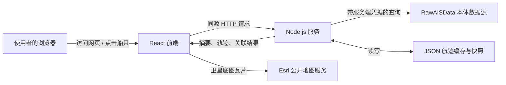
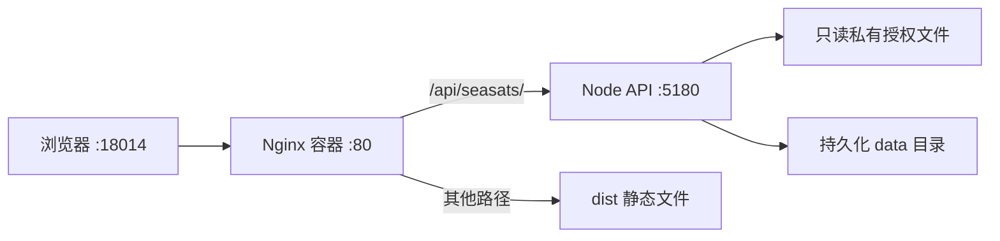

# 无人艇跟监告警智能体：从零开始学习教程

> 面向对象：没有接触过前端、后端、框架或中间件的学习者。
>
> 本文以当前项目的真实代码为准，目标不是让你先背术语，而是让你能回答三个问题：**它在解决什么问题、数据怎样走、我应从哪里安全地读和改代码。**

---

## 1. 先用一句话认识这个项目

这是一个网页化的海上目标监测系统。它从受保护的 `RawAISData` 数据源读取 AIS 航迹，针对配置好的船舶名单做轨迹、低速、AIS 信号缺口、接近中国海岸和航母关联分析，再把结果显示在地图、列表、图表与详情弹窗中。

这里的“智能体”不是聊天机器人，也不是自动操控无人艇；它是把固定规则和数据处理流程组合起来，自动产出“值得关注的船、证据和告警”的业务系统。

### 1.1 先认识几个业务词

| 词 | 通俗解释 | 在本项目中的含义 |
| --- | --- | --- |
| AIS | 船舶自动识别系统，可定期发送身份、位置、速度等信息 | 每一条 AIS 记录会成为航迹上的一个报点 |
| MMSI | 船舶的海上身份编号 | 例如 `338555318`；系统用它唯一定位受监测对象 |
| 航迹 | 同一船按时间排列的一串位置点 | 由经纬度、时间、速度、航向等报点组成 |
| 节（kt） | 海上速度单位 | 1 节约等于每小时 1 海里 |
| 海里（nm） | 海上距离单位 | 1 海里 = 1.852 千米 |
| 本体 / DaaS | 本项目的外部数据服务 | 服务端通过它查询 `RawAISData`，浏览器不直接接触它 |
| 快照 | 某一时刻计算出的完整结果副本 | 保存为 JSON，页面可先读快照，再由后台刷新 |

---

## 2. 学习前的心理模型：它是“前台 + 后台 + 数据源”

不要把整个项目看成一团代码。把它想成餐厅：前台负责展示和点单，后厨负责取料和烹饪，仓库负责提供原料。



这张图有两个很重要的安全边界：

1. 浏览器只请求本项目的 `/api/seasats/...` 接口，**不会拿到本体访问令牌**。
2. 服务端可以读取本体访问配置、保存缓存并执行较重的计算，前端只做显示和交互。

---

## 3. 框架、中间件到底是什么？本项目实际用了什么？

初学时不用把“框架”和“中间件”当成神秘概念。

- **运行时**：让代码能运行的环境。这里是 **Node.js**，它让 JavaScript 能在浏览器外、服务器上运行。
- **框架 / UI 库**：帮你组织界面的工具。这里是 **React**，它把页面拆成许多可复用的组件。
- **构建工具**：把开发代码变成浏览器能高效加载的文件。这里是 **Vite**。
- **地图库**：负责地图缩放、图层和标记。这里是 **MapLibre GL JS**。
- **反向代理**：站在用户请求和内部服务之间转发请求的服务。线上使用 **Nginx**。
- **容器**：把运行环境和应用包装起来，减少“换台机器不能运行”的问题。线上使用 **Podman**，其使用方式与 Docker 很相近。
- **中间件**：通常指“请求经过的中间层软件或程序”。本项目没有 Express/Koa 那种代码级中间件链；从部署角度看，Nginx 是位于浏览器和 Node 服务之间的中间层。

项目依赖清单在 [`package.json`](../package.json)。其中最值得先认识的是：

| 依赖 | 用途 | 你现在要掌握到什么程度 |
| --- | --- | --- |
| `react`、`react-dom` | 生成网页界面 | 知道组件、状态、事件即可 |
| `vite`、`@vitejs/plugin-react` | 本地开发和打包 | 会运行 `npm run dev`、`npm run build` 即可 |
| `maplibre-gl` | 业务图层叠加在地图上 | 知道地图由图层组成即可 |
| `lucide-react` | 图标库 | 不涉及业务逻辑，可暂时跳过 |

特别注意：后端没有使用 Express、NestJS、数据库 ORM 或 Redis。它直接使用 Node.js 自带的 `http`、文件系统和工作线程模块，缓存则落在 JSON 文件里。因此阅读后端时，不必先学习一大套后端框架。

---

## 4. 目录地图：每个文件夹负责什么

```text
seasats-usv-track-alert-agent/
├─ src/                       前端源代码（浏览器界面与纯计算）
│  ├─ app/                    React 页面组件
│  ├─ logic/                  可独立测试的业务计算函数
│  ├─ data/chinaCoast.json    中国海岸简化线，用于距离计算
│  └─ styles/global.css       全局样式
├─ server/                    Node.js 服务端源代码
│  ├─ app-server.js           服务入口、接口、取数、缓存、调度
│  ├─ seasatsScope.js         受监测 MMSI 名单
│  ├─ monitoringRules.js      监测区域与基础告警阈值
│  ├─ carrierAffiliation.js   无人艇与航母关联算法
│  ├─ trackWindows.js         大数据量分时间窗获取与去重工具
│  ├─ *worker.js              把耗时计算放到工作线程
│  └─ data/                   运行后生成或更新的缓存快照
├─ deploy/nginx.conf          线上 Nginx 转发配置
├─ scripts/build-data.py      早期 Excel 数据处理脚本，不是当前运行时主数据链路
├─ data/raw/                  原始 Excel 资料；当前网页运行时不直接读取
├─ dist/                      `npm run build` 生成的前端产物，不手工改
├─ docs/                      项目说明、修改记录和本文
├─ package.json               命令、依赖和项目信息
└─ vite.config.js             Vite 本地开发配置
```

### 哪些地方可以读，哪些地方先不要改？

优先只读：`README.md`、`server/seasatsScope.js`、`server/monitoringRules.js`、`src/app/App.jsx`、`server/app-server.js`。

初学阶段不要手工修改：

- `dist/`：这是构建结果，下次打包会被重新生成。
- `server/data/tracks/*.json`、`fleet-summary-snapshot.json`：这是运行缓存；删改会导致重拉或使页面结果不可信。
- 任何 `ontology.env` 或令牌文件：它们是凭据，不应提交、截图或复制到聊天中。
- `package-lock.json`：只有确实变更依赖时才由 npm 自动更新。

---

## 5. 从打开页面到显示告警：一条数据的完整旅程

### 第一步：前端启动

浏览器加载 `index.html`，随后执行 [`src/main.jsx`](../src/main.jsx)，它将根组件 [`src/app/App.jsx`](../src/app/App.jsx) 挂到页面上。可以把 `App.jsx` 理解为整个界面的总调度员。

### 第二步：前端请求摘要

`App.jsx` 会请求：

```text
GET /api/seasats/summary
```

若服务端仍在刷新所有船的航迹和研判，会返回 `202` 以及 `{"status":"refreshing"}`。这不是错误；前端每 5 秒重试一次。准备好后返回 `200` 和完整摘要。

### 第三步：服务端读取或更新轨迹

[`server/app-server.js`](../server/app-server.js) 会按 [`server/seasatsScope.js`](../server/seasatsScope.js) 中的 MMSI 名单处理目标：

1. 尝试读取 `server/data/tracks/<MMSI>.json` 中已有的轨迹缓存。
2. 缓存不存在、版本不匹配，或要强制刷新时，从 `2025-01-01` 起向本体查询。
3. 若已有缓存，则从最新时间点向前回退 2 小时，再增量查询；这个重叠区间可吸收迟到或乱序报点。
4. 合并、按业务键去重、按时间排序，然后原子写回 JSON 缓存。

为什么不一次把全部数据拉回来？本体接口单次结果过大可能被静默截断。项目先探测每个时间窗的记录数量，数量过大就把窗口按“月 → 日 → 二分”继续拆小，最低到 1 小时，尽量保证拿到完整数据。这部分逻辑在 [`server/trackWindows.js`](../server/trackWindows.js) 和 `app-server.js` 中。

### 第四步：将原始 AIS 记录整理成统一格式

本体字段与页面字段并不完全一样。`normalizePoint()` 做了一次翻译：

| 本体字段 | 项目内字段 | 意义 |
| --- | --- | --- |
| `mmsi` | `mmsi` | 船舶编号 |
| `latitude` / `longitude` | `lat` / `lon` | 纬度 / 经度 |
| `sog` | `speedKn` | 对地航速（节） |
| `courseOverGround` | `courseDeg` | 对地航向 |
| `trueHeading` | `heading` | 真航向 |
| `startTime` / `dataUpdateTime` | `time` | 报点时间 |

时间没有时区时，项目按北京时间解释后转成标准 UTC 格式。原始数据中的异常或无效坐标会在后续清洗时被剔除。

### 第五步：按规则计算告警与评分

服务端把轨迹交给 [`src/logic/domain.js`](../src/logic/domain.js) 中的纯函数计算，再得出每条目标的状态、分数、证据和告警。纯函数的好处是：相同输入必定得到相同输出，因此容易测试。

当前基础规则配置在 [`server/monitoringRules.js`](../server/monitoringRules.js)：

| 项目 | 当前规则 |
| --- | --- |
| 低速 | 速度 `0–3 节` |
| 持续低速告警 | 在一个监测区域内累计至少 `10 分钟` |
| 往返/盘旋 | 路径长度 ÷ 首尾位移 `≥ 3`，且持续至少 `10 分钟` |
| AIS 缺口 | 同 MMSI 相邻报点间隔大于 `30 分钟`；超过 `6 小时`为严重 |
| 分段边界 | 时间间隔超过 `6 小时`或空间跳变超过 `50 海里`时切段 |

此外，海岸距离使用 `src/data/chinaCoast.json` 这条简化海岸线计算。README 还定义了国土告警等级：距离中国海岸小于 80 海里为高、80–140 为中、140–200 为低。当前基础参数中未固定这三项，而是在业务分析逻辑的默认参数中合并使用；改动前应同时查看对应测试。

### 第六步：把计算结果保存为快照

系统将完整态势写入 `server/data/fleet-summary-snapshot.json`，并将航母关联结果写入 `server/data/carrier-affiliation-history.json`。写入采用“先写临时文件再替换”的方式，尽量避免程序中断时留下半份 JSON。

刷新节奏：

- 舰船态势摘要：约每 30 分钟刷新。
- 航母关联历史：约每 5 小时刷新。

### 第七步：前端绘制界面

前端拿到摘要后，`App.jsx` 把数据交给多个组件：

| 组件 | 主要职责 |
| --- | --- |
| `SummaryPanel.jsx` | 总体摘要和目标列表 |
| `MapPanel.jsx` | MapLibre 地图、轨迹和告警图层 |
| `PlaybackControlBar.jsx` | 时间和回放控制 |
| `VesselFocusPanel.jsx` | 选中船详情、航母关联弹窗和轨迹对比 |
| `AnalysisPanel.jsx` | 速度、距离、航向、活动时段等图表 |
| `RemotePlaybackMap.jsx` | 远程回放地图容器 |

用户点选一艘船时，前端会额外请求：

```text
GET /api/seasats/vessels/<MMSI>/track
```

只有 [`server/seasatsScope.js`](../server/seasatsScope.js) 名单内的 MMSI 可以被查询。这个限制既减少误用，也避免接口变成任意船舶数据查询器。

---

## 6. 航母关联分析：初学者应怎样理解

这是项目中计算量较大的一部分，代码在 [`server/carrierAffiliation.js`](../server/carrierAffiliation.js)。目标是评估某艘无人艇（或候选目标）与航母的历史航迹是否存在空间和时间上的相互跟随关系。

它不是“证明两者一定隶属”的魔法判断，而是根据距离、航向、时间偏移和命中比例生成可审计的关联证据。

核心口径如下：

| 参数 | 当前值 | 直观含义 |
| --- | --- | --- |
| 同步距离阈值 | 20 海里 | 同一时刻附近的近距离判定 |
| 同步航向差 | 30° | 同步分析时的航向接近程度 |
| 最大时间滞后 | ±30 天 | 允许一方相对另一方提前或滞后 |
| 粗搜索步长 | 1 天 | 先快速找可能的时间偏移 |
| 细搜索步长 | 1 小时 | 在候选范围精细比较 |
| 滞后距离阈值 | 500 海里 | 关联分析使用的距离门槛 |
| 局部命中比例 | 70% | 满足条件的比例门槛 |
| 最小匹配点 | 8 个 | 数据太少时不下结论 |

为了防止这项计算卡住网页服务，它由 `carrier-affiliation-worker.js` 放在 **Worker Thread（工作线程）**中执行。可把它看成 Node.js 在旁边开了一个专门干重活的工人；HTTP 主线程仍可以继续响应页面请求。

航向字段使用优先级为：`trueHeading`（项目字段 `heading`）优先，缺失时才回退到 `courseOverGround`（项目字段 `courseDeg`）。`511`、空值、非数字被视为没有有效航向。任意一侧整条轨迹都没有可用航向时，该配对会明确显示“航向数据不足，未进行关联分析”，而不会编造结果。

---

## 7. 本地运行：先分清“看界面”和“跑真实数据”

### 7.1 前提

在 Windows PowerShell 中进入项目目录：

```powershell
cd C:\Project\xian630\scene\seasats-usv-track-alert-agent
```

项目需要 Node.js。先确认：

```powershell
node --version
npm --version
```

首次获取依赖：

```powershell
npm install
```

`node_modules/` 是下载到本机的依赖目录，体积大但可以随时由 `npm install` 重建，因此不会提交到 Git。

### 7.2 开发模式：前端与后端分开启动

打开两个 PowerShell 窗口。

窗口 A，启动后端：

```powershell
npm start
```

默认监听 `http://127.0.0.1:5180`。它会提供 API，也能在已有 `dist/` 时提供静态网页。

窗口 B，启动前端开发服务器：

```powershell
npm run dev
```

Vite 默认地址为 `http://127.0.0.1:5179`。`vite.config.js` 已把 `/api/seasats` 自动转发到 `5180`，因此浏览器仍然像访问同一个网站一样调用 API。

### 7.3 真实数据运行的授权边界

后端要调用外部本体时需要授权配置，例如 `ONTOLOGY_API_BASE_URL`、`ONTOLOGY_AUTH_TOKEN`、`ONTOLOGY_SPACE_ID`。这些值不在教程中给出，也不应写入代码、Git、截图或聊天记录。

生产环境通过私有 `ontology.env` 文件挂载，并用 `ONTOLOGY_ENV_FILE` 指向它。若本地没有授权配置，后端可能返回 `SOURCE_AUTH_MISSING`，这是正常的安全保护，而不是“代码坏了”。需要真实数据访问权时，应向项目负责人申请合规的开发环境配置。

### 7.4 打包和检查

```powershell
npm test
npm run build
```

- `npm test`：运行 Node 内置测试，重点验证规则、轨迹清洗、告警、前端逻辑等。
- `npm run build`：由 Vite 生成 `dist/`，这是发布前必须通过的构建检查。

若只想预览打包后的前端，可使用：

```powershell
npm run preview
```

---

## 8. API 小抄：前端与后端如何对话

| 请求 | 成功时 | 说明 |
| --- | --- | --- |
| `GET /api/seasats/summary` | `200` | 全部监测目标、告警、摘要和默认轨迹 |
| `GET /api/seasats/summary` | `202` | 服务端正在刷新；前端应稍后重试 |
| `GET /api/seasats/affiliations` | `200` | 航母关联历史快照或当前生成状态 |
| `GET /api/seasats/vessels/<MMSI>/track` | `200` | 指定名单内船舶的完整轨迹 |
| `GET /api/seasats/vessels/<MMSI>/track?render=1` | `200` | 为图表抽稀过的渲染轨迹，最多约 3000 点 |

`render=1` 是性能优化：完整轨迹可能有十万甚至更多点，直接发送给弹窗会让浏览器变慢。服务端会保留首尾和关键极值，生成较小的“用于画图的版本”。它只影响显示，**不会**改变后台实际分析、告警结论或无参数接口返回的全量数据。

---

## 9. 线上部署：理解结构即可，先不要自行发布

线上公开入口由运维配置在专用端口。生产结构为：



- `deploy/nginx.conf` 负责把 `/api/seasats/` 转给 Node，其余请求返回 React 打包后的页面。
- Nginx 和 Node 分别在 Podman 容器中运行；Node 不直接对公网暴露。
- `server/data/` 是可写的持久化数据，部署新版本时**绝不能覆盖或删除**。
- 授权文件以只读方式挂载，绝不能打进发布包。
- 标准发布需要先通过 `npm test` 和 `npm run build`，并采用可回滚的原子切换流程。

因此，学习阶段请只在本地运行和阅读。生产发布涉及数据连续性、凭据和回滚，必须遵循项目既有运维流程并由有权限的人员执行。

---

## 10. 最安全的第一次改动：改规则或新增受监测船

### 10.1 修改基础阈值

例如将低速上限从 3 节改为 4 节，目标文件是 [`server/monitoringRules.js`](../server/monitoringRules.js)：

```js
export const JUDGEMENT_PARAMETERS = {
  lowSpeedMaxKn: 4,
  // 其他字段保持不变
};
```

但不要只改一行就提交。完整步骤应是：

1. 先在同文件和 `src/logic/domain.test.js` 搜索 `lowSpeedMaxKn`，理解受影响的判断。
2. 修改规则，并在需要时补充或修改测试用例。
3. 执行 `npm test`。
4. 执行 `npm run build`。
5. 在本地页面检查告警文案、列表和地图是否一致。
6. 将“为什么要改、改了什么、如何验证”写到 [`docs/修改记录.md`](修改记录.md)。

业务阈值不是普通样式参数；它会改变告警和评分口径，修改前应获得业务确认。

### 10.2 新增一艘受监测船

目标文件是 [`server/seasatsScope.js`](../server/seasatsScope.js)，`defaultVessels` 数组中每项的最小格式为：

```js
{ mmsi: "123456789", name: "示例船", role: "候选舰船" }
```

可选字段包括：

- `code`：舷号或代号，如 `DDG-XX`；
- `shortName`：侧栏展示的短名称；
- `englishName`、`chineseName`：已确认的双语名称；
- `role`：例如“无人艇”“航母”“候选舰船”。

新增前先确认 MMSI 的来源、是否应被监测、名称是否可靠，以及是否有访问该船 AIS 数据的授权。服务启动后它会被纳入刷新和缓存范围，首次获取历史航迹可能耗时较长。

### 10.3 改页面时从哪里开始

| 想改什么 | 优先看哪里 |
| --- | --- |
| 整体数据加载、选中船状态 | `src/app/App.jsx` |
| 地图标记、图层、飞行定位 | `src/app/MapPanel.jsx` |
| 左右面板与详情 | `src/app/SummaryPanel.jsx`、`VesselFocusPanel.jsx` |
| 图表指标和取样 | `src/app/AnalysisPanel.jsx`、`src/logic/analytics.js` |
| 样式、响应式布局 | `src/styles/global.css` |

React 的最小阅读方法：组件是返回 JSX 的函数；`useState` 保存会变化的数据；`useEffect` 处理“组件显示后去请求数据、监听事件、清理资源”等副作用。先沿着 `App.jsx` 中的 `fetch()`、`selectedMmsi` 和传给子组件的属性读下去，比从 CSS 或大算法文件开始容易得多。

---

## 11. 常见问题排查

| 现象 | 可能原因 | 先做什么 |
| --- | --- | --- |
| 页面一直显示“数据加载中” | 首次全量刷新未结束，或本体数据访问失败 | 查看后端终端日志；确认不是短暂的 `202 refreshing` |
| 返回 `SOURCE_AUTH_MISSING` | 本地没有合规的本体授权配置 | 不要自行猜测令牌；联系负责人申请开发配置 |
| 地图没有卫星底图但标记还在 | Esri 瓦片网络不可用 | 检查网络；业务 GeoJSON 图层仍可工作 |
| 目标点选后没有轨迹 | MMSI 不在受监测范围、没有数据或查询失败 | 先检查 `seasatsScope.js` 和服务端日志 |
| 前端改了但浏览器没变化 | 看的可能是旧 `dist` 或缓存 | 开发时访问 Vite 的 5179；生产式验证前重新执行 `npm run build` |
| `npm test` 失败 | 改动破坏了既有业务口径 | 先读失败测试的断言，不要为了通过测试而删断言 |
| 轨迹缓存看起来不包含刚回填的历史数据 | 增量刷新只从水位线附近补数据 | 需要按既有版本判废流程触发合规的全量重拉，不能随意删缓存 |

---

## 12. 推荐学习路线（按天或按阶段）

### 阶段 A：只理解，不动代码

1. 读 `README.md`，再读本文第 1、2、4、5 节。
2. 打开 `server/seasatsScope.js`，认识 MMSI 和监测名单。
3. 打开 `server/monitoringRules.js`，把每条规则翻译成自然语言。
4. 在浏览器打开本地页面，分别点击一艘无人艇、一艘航母和一艘候选舰船，观察左栏、地图和右栏如何变化。

### 阶段 B：建立前后端连接感

1. 运行前后端开发模式。
2. 在浏览器开发者工具的 Network（网络）页观察 `/api/seasats/summary` 与 `track` 请求。
3. 对照 `App.jsx` 的 `fetch()` 和 `app-server.js` 的路由代码，理解“一条请求在两端如何接上”。

### 阶段 C：理解规则与测试

1. 阅读 `src/logic/domain.test.js` 与 `server/trackWindows.test.js`。
2. 学会运行 `npm test`。
3. 找一个不改变业务含义的小练习，例如为已有函数补充注释，或为一个边界输入补一个测试。

### 阶段 D：理解性能与发布

1. 阅读 `trackWindows.js`，理解为什么要拆时间窗。
2. 阅读 `carrier-affiliation-worker.js`，理解为什么耗时分析不能阻塞 HTTP 服务。
3. 阅读 `deploy/nginx.conf` 和本文第 9 节；只理解部署边界，不在未授权情况下操作生产。

---

## 13. 一份每天可用的操作清单

开始修改前：

```powershell
cd C:\Project\xian630\scene\seasats-usv-track-alert-agent
git status --short
npm test
```

修改并自测后：

```powershell
npm test
npm run build
git diff --check
git status --short
```

最后，请养成三条习惯：

1. **先看数据来源，再相信画面。** 页面上的数字来自快照和本体，不是凭空产生的。
2. **先看测试意图，再修改规则。** 告警阈值会改变业务结论。
3. **凭据、缓存、构建产物不当作普通代码修改。** 它们分别关系到安全、数据连续性和可重复构建。

掌握本文后，你已经足够开始进行“安全阅读 + 小范围修改”。下一步最值得深入的文件顺序是：`App.jsx` → `app-server.js` → `domain.js` → `carrierAffiliation.js`。
